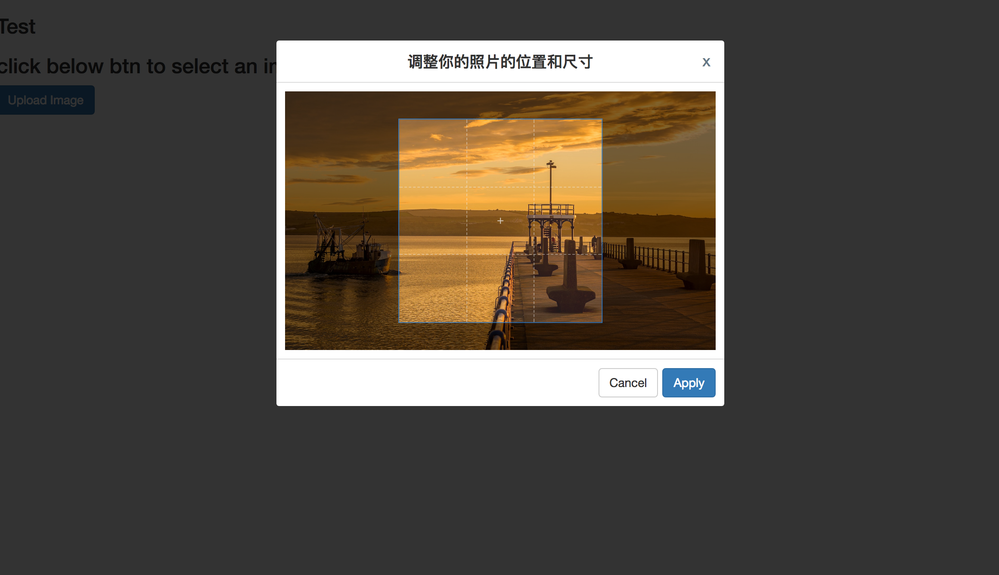

# ngx-cropper

An Angular image plugin, includes upload, cropper, save to server.

 [](http://makeapullrequest.com)

## Example



## Usage

### 1. Install

```bash
  npm i -S ngx-cropper
```

### 2. Config __example.module.ts__

```typescript
import { CropperModule } from 'ngx-cropper';

@NgModule({
  imports: [
    CropperModule
  ]
})
```

Config global styles.
If you use ```@angular/cli```, you could config global styles

```css
@import '~cropper/lib/cropperjs.css';
```

### 3. Config __example.component.html__

```html
  <ngx-cropper [config]="cropperConfig" (returnData)="onReturnData($event)"></ngx-cropper>
```

### 4. Config __example.component.ts__

```typescript
import { CropperOption } from 'ngx-cropper';

@component()
export class ExampleComponent {
  public cropperConfig: CropperOption;

  constructor() {
    this.cropperConfig = {
      url: null, // image server url
      maxsize: 512000, // image max size, default 500k = 512000bit
      title: 'Apply your image size and position', // edit modal title, this is default
      uploadBtnName: 'Upload Image', // default Upload Image
      uploadBtnClass: null, // default bootstrap styles, btn btn-primary
      cancelBtnName: 'Cancel', // default Cancel
      cancelBtnClass: null, // default bootstrap styles, btn btn-default
      applyBtnName: 'Apply', // default Apply
      applyBtnClass: null, // default bootstrap styles, btn btn-primary
      errorMsgs: {  // These error msgs are to be displayed to the user (not the ones sent in returnData)
        4000: null, // default `Max size allowed is ${maxsize}kb, current size is ${currentSize}kb`
        4001: null  // default 'When sent to the server, something went wrong'
      },
      fdName: 'file', // default 'file', this is  Content-Disposition: form-data; name="file"; filename="fire.jpg"
      aspectRatio: 1 / 1, // default 1 / 1, for example: 16 / 9, 4 / 3 ...
      viewMode: 0 // default 0, value can be 0, 1, 2, 3
    };
  }

  // deal callback data
  public onReturnData(data: any) {
    // Do what you want to do
    console.warn(JSON.parse(data));


    //  Here has three type of messages now
    //  1. Max size
    // {
    //     code: 4000,
    //     data: currentSize,
    //     msg: `Max size allowed is ${this.viewConfig.maxsize / 1024}kb, current size is ${currentSize}kb`
    //  }

    //  2. Error
    //  {
    //       code: 4001,
    //       data: null,
    //       msg: 'ERROR: When sent to the server, something went wrong, please check the server url.'
    //  }

    //  3. Image type error
    // {
    //       code: 4002,
    //       data: null,
    //       msg: `The type you can upload is only image format`
    // }

    //  4. Success
    //  {
    //       code: 2000,
    //       data,
    //       msg: 'The image was sent to the server successfully'
    //  }
  }
}
```

## Development

> Welcome you join us and develop together, it's my honor you commit pull request.

```bash
git clone git@github.com:TaylorPzreal/ngx-cropper.git

ng serve # start developing

ng build cropper# start building prod packages
```
